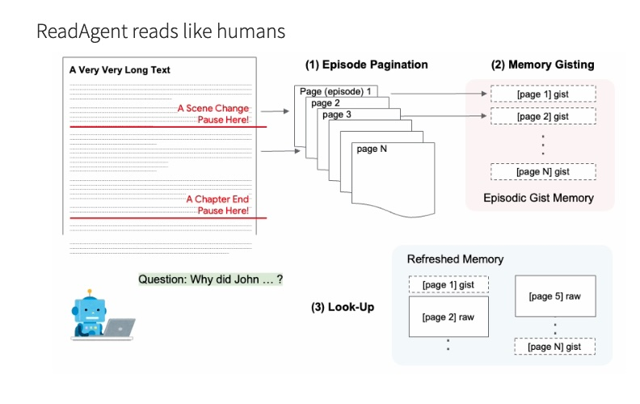

# Gist-Based Development Assistant for Java Projects

Inspired by the research on [A Human-Inspired Reading Agent with Gist Memory of Very Long Contexts](https://arxiv.org/abs/2402.09727), this project applies a similar gisting approach to facilitate development tasks within large Java codebases. By summarizing and indexing Java files and packages, our system enables developers to easily navigate and understand complex projects, streamlining the maintenance and enhancement process.


## About the Paper

The research paper discusses "ReadAgent," a system inspired by how humans read and understand long documents. Unlike current computer models that struggle with very long texts, ReadAgent mimics human reading by breaking texts into manageable parts (episodes), summarizing them into "gist memories" (key ideas), and referring back to the original text for details when necessary. This approach helps ReadAgent understand and remember the main points from long documents better than traditional methods, allowing it to perform better on tasks that involve reading comprehension of lengthy texts.

below image from [https://read-agent.github.io/](https://read-agent.github.io/) demontrates the intuitive approach.




## Apply the Approach to Large Java Codebase

There have been tremendous advancements in Large Language Models (LLMs) in recent years, leading to the development of various techniques to leverage LLMs across a wide range of use cases. Specifically, in the realm of programming, tools such as GitHub Copilot have proven highly effective at providing code completion for smaller coding tasks. However, navigating and understanding large codebases remains a significant challenge. To address this, several initiatives have focused on an agent-based approach, including tools like AugoGPT, ChatDev and other Agent-based systems. 

The primary objective of this project is to apply diverse techniques to assist with ~~coding~~ development tasks. For instance, offer guidance on programming steps for junior engineers, as opposed to generating code directly, which might be more suitably handled by Copilot. 

## Overview

Leveraging the concept of "gisting," our system preprocesses Java projects to create concise summaries or "gists" of both individual files and entire packages. These gists serve as an easily navigable index, helping developers and language models alike grasp the project's structure and content at a glance.

### Features

- **File and Package Gisting**: Generates summaries for Java files and aggregates these into higher-level package gists.
- **Interactive Querying with LLM**: Asks language models (LLMs) development-related questions, providing them with the project's gist to obtain informed, context-aware guidance.

### Try Notebook

[](https://mybinder.org/v2/gh/jyouturner/read-agent-java/HEAD?labpath=read-agent-java.ipynb)


## How It Works

Similar to how human being appoach to any maintenance of legacy code, we ask LLM to do a one time "gisting"

1. Gist Java programs

We send the Java files to LLM one by one with prompt for summaries


The results are stored in a local file "code_files.txt", this is our "index".

We can build our code files graph now.


2.Gist Java packages

We do a travers of the graph recusivingly from bottom up. For each package, we combine the summaries of sub-packages and files and send to LLM to summarize it.


The results are saved in a local file "package_notes.txt" file.


3.Ask

Once we have the "indexing" or "gisting" done. We can start to ask LLM quetions. In this case, we want to give LLM a task, and ask it to provide steps to accomplish the task.

In the first prompt to LLM, we specify its role, the task to work on, and the brief information of the project (for example, the top-down tree view). We also instruct LLM to ask more information about files and packages whenver necessary. In the following conversations, we will provide the summary or notes of the files (including source code) or packages, this conversation will continue until the LLM does not need more information (or reach to the maximum round of conversations)


### About the Sample Project

A sample Java project is included in this repo, under "data" folder. It is an open source project available at Github [https://github.com/ilkeratik/travel-service](https://github.com/ilkeratik/travel-service).


### Getting Started

To set up and start using the Gist-Based Development Assistant:

```sh
python3 -m venv venv
source venv/bin/activate
pip3 install -r requirements.txt
```

### Set LLM and API Key

We are using OpenAI gpt-4-1106-preview, first to set the OPENAI_API_KEY in dot env file

```sh
cp .env.example .env
vi .env
```

## Tracing

We use Ariz Phoenix for tracing.

### install the Phoenix at local

The easist way is to use the docker image that I created

```sh
docker pull jy2947/arize-ai-phoenix:20240303
docker run -d --name phoenix -p 6006:6006 jy2947/arize-ai-phoenix:20240303
```

Then, visit [http://localhost:6006/tracing](http://localhost:6006/tracing)

### First to Gist code files

```sh
python3 gist_files.py --project_root=./data/travel-service-dev
```

It will take a while before all the Java files are gisted. You will see a txt file "code_files.txt" generated afterwards, under the "data/travel-service-dev" folder.

### Next to Gist packages

```sh
python3 gist_packages.py --project_root=./data/travel-service-dev
```

After the process is done, you will see a file "package_notes.txt" created in the "data/travel-service-dev" folder.

### Now Ask LLM to Assist Coding Task

```sh
python3 ask.py --project_root=./data/travel-service-dev --question="add a new field 'mayor' to city, for the name of the mayor of the city"

python3 ask.py --project_root=./data/travel-service-dev --question="add a new feature to search city by name"

python3 ask.py --project_root=./data/travel-service-dev --question="refactor the Rest API to GraphQL"

```

## Tracing


## Thoughts on Future Improvements

This project serves as an effective starting point for leveraging Large Language Models (LLMs) to assist in maintaining large legacy codebases. Similar to other efforts in this domain, the quality of the outcomes is significantly influenced by below factors:

1. The sophistication of the LLM. For instance, throughout our testing, we have observed markedly improved outcomes with the use of OpenAI's GPT-4, highlighting the impact of the model's "intelligence" on the results.

2. The relevance of the assistance provided to the LLM. Currently, our input to the LLM consists mainly of summaries of programs and packages. However, in practice, developers derive the most benefit from examining and understanding changes made in previous similar tasks. This includes, for example, searching for and comprehending adjustments from past Pull Requests (PRs). This insight suggests that enhancing the context and specificity of the information supplied to the LLM could significantly improve its utility in real-world programming scenarios.

3. Capitalizing on the "memory" of the LLM. Each interaction with the LLM brings it closer to the optimal solution. However, given the stateless nature of these models, they rely solely on the information provided in the current prompt. Therefore, effectively preserving and incorporating relevant details from past conversations into new requests is crucial. This strategy helps the LLM build on previous interactions, accelerating the progress towards the final answer. Ensuring that essential insights and progress are seamlessly integrated into each new request can significantly enhance the LLM's ability to assist in complex tasks, making it a more effective tool for navigating and understanding large codebases.

4. Exploring more efficient strategies - Currently, our approach involves distinct phases, such as initially creating a gist of the entire project. This method, while comprehensive, is not the most cost-effective for large codebases. Specifically, in the context of Java projects, numerous files (such as data, DTOs, exceptions, constants, etc.) may be unnecessary for understanding the high-level design. A more efficient approach could be to implement a "gist-on-demand" approach. This may lead to a "multi-agenta" architecture.

5. Refining the Gisting Process: Given our focus on addressing high-level tasks rather than detailed coding, the current gisting method is "good enough." It significantly reduces the workload by eliminating the need for indexing Java classes and methods, as would be required in static analysis, thanks to the assistance of LLMs. Therefore, there's minimal necessity for sophisticated persistence mechanisms like databases. However, it remains essential to ensure that the generated gists are accessible to all team developers and that the "source record" is maintained. To achieve this, it' make sense to integrate the gisting process into the codebase as part of the Continuous Integration (CI) workflow. We can leave this to the user to decide.