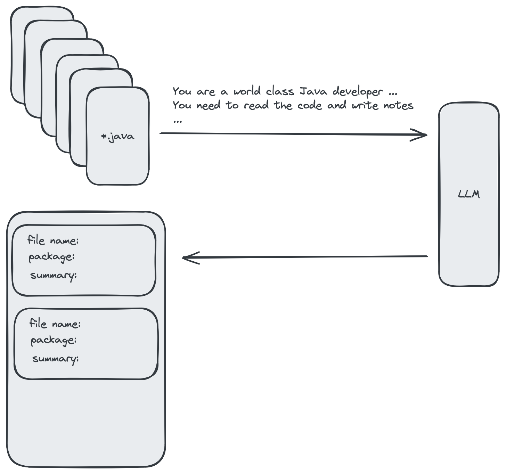
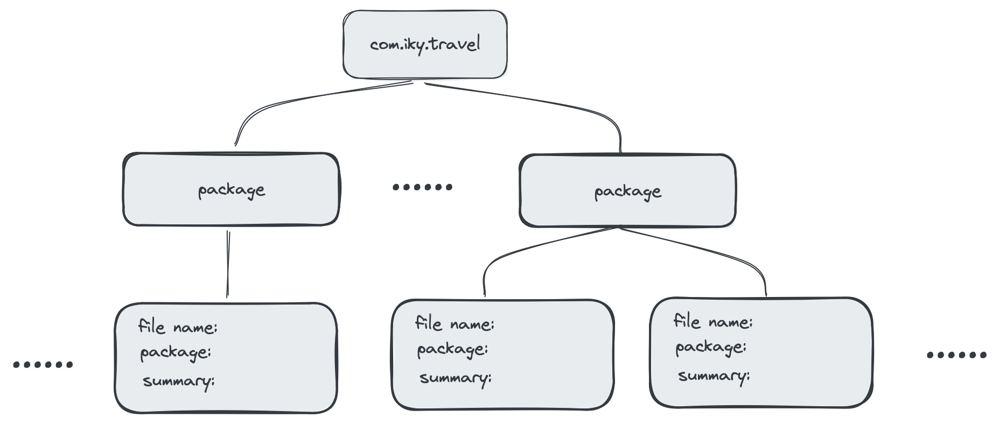
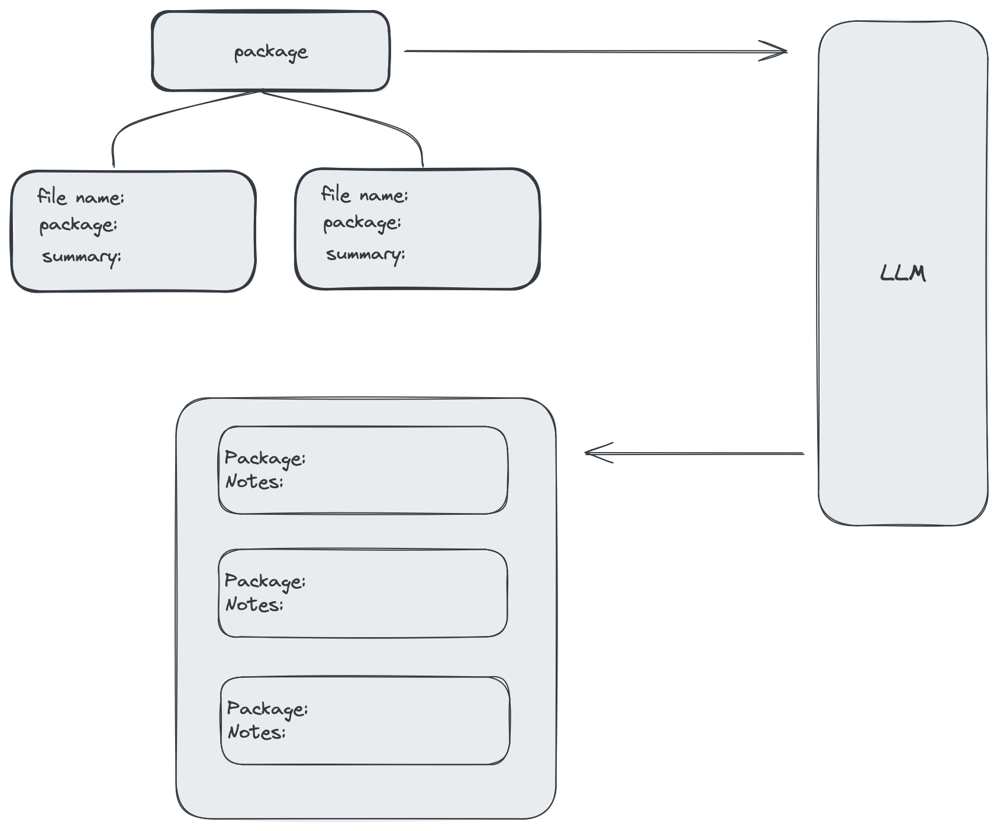
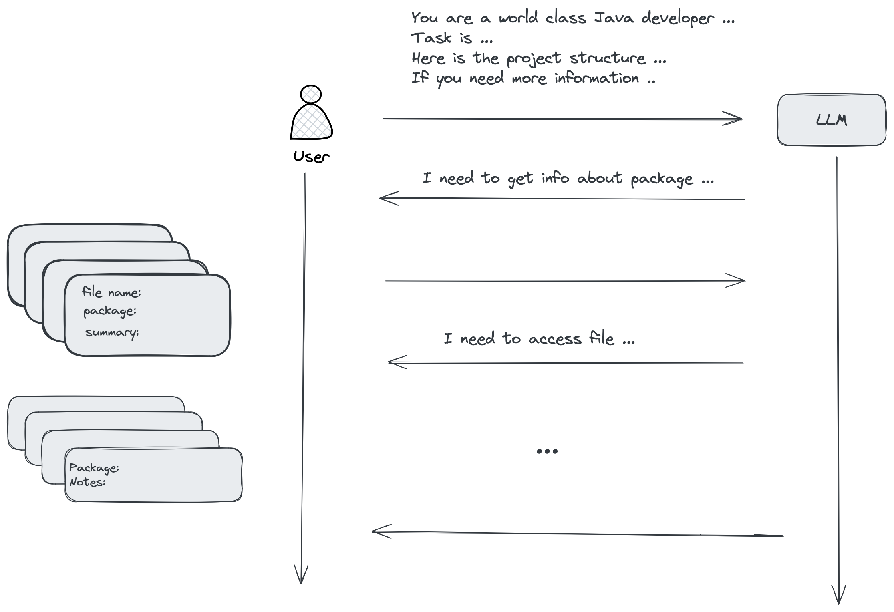
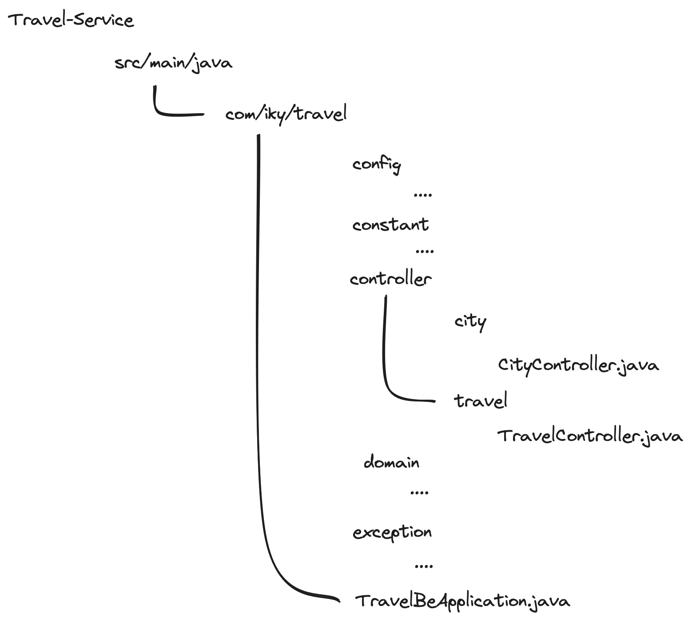
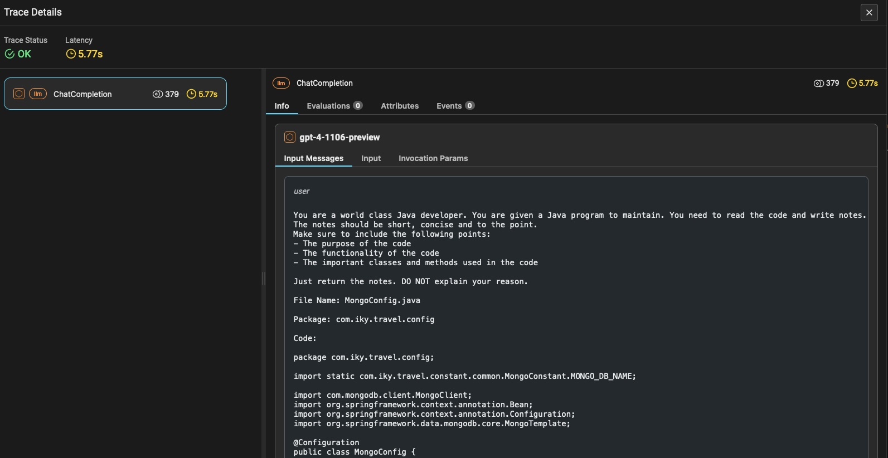
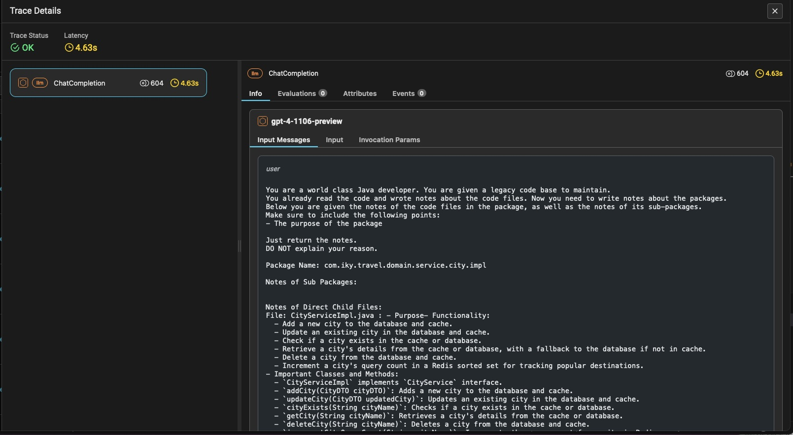
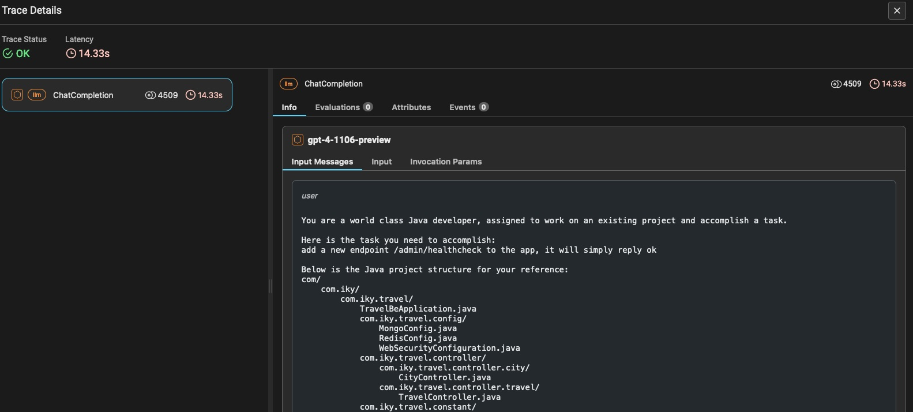

# Gist-Based Development Assistant for Java Projects

Inspired by the research on [A Human-Inspired Reading Agent with Gist Memory of Very Long Contexts](https://arxiv.org/abs/2402.09727), this project applies a similar gisting approach to facilitate development tasks within large Java codebases. By summarizing and indexing Java files and packages, our system enables developers to easily navigate and understand complex projects, streamlining the maintenance and enhancement process.

## Overview

Leveraging the concept of "gisting," our system preprocesses Java projects to create concise summaries or "gists" of both individual files and entire packages. These gists serve as an easily navigable index, helping developers and language models alike grasp the project's structure and content at a glance.

### Features

- **File and Package Gisting**: Generates summaries for Java files and aggregates these into higher-level package gists.
- **Interactive Querying with LLM**: Asks language models (LLMs) development-related questions, providing them with the project's gist to obtain informed, context-aware guidance.


### Getting Started

To set up and start using the Gist-Based Development Assistant:

```sh
python3 -m venv venv
source venv/bin/activate
pip3 install -r requirements.txt
```

### Set LLM and API Key

We are using OpenAI gpt-4-1106-preview, first to set the OPENAI_API_KEY in dot env file

```sh
cp .env.example .env
vi .env
```

## Tracing

We use Ariz Phoenix for tracing.

### install the Phoenix at local

The easist way is to use the docker image that I created

```sh
docker pull jy2947/arize-ai-phoenix:20240303
docker run -d --name phoenix -p 6006:6006 jy2947/arize-ai-phoenix:20240303
```

Then, visit [http://localhost:6006/tracing](http://localhost:6006/tracing)

## About the Paper

The research paper discusses "ReadAgent," a system inspired by how humans read and understand long documents. Unlike current computer models that struggle with very long texts, ReadAgent mimics human reading by breaking texts into manageable parts (episodes), summarizing them into "gist memories" (key ideas), and referring back to the original text for details when necessary. This approach helps ReadAgent understand and remember the main points from long documents better than traditional methods, allowing it to perform better on tasks that involve reading comprehension of lengthy texts.


## Apply the Approach to Large Codebase

This repo has our attempts to apply the same approach to programming tasks in large codebase, for example, an existing Java project.

Similar to how human being appoach to any maintenance of legacy code, we ask LLM to do a one time "gisting"

1. Gist Java programs

We send the Java files to LLM one by one with prompt for summaries




The results are stored in a local file "code_files.txt", this is our "index".

We can build our code files graph now.




2.Gist Java packages

We do a travers of the graph recusivingly from bottom up. For each package, we combine the summaries of sub-packages and files and send to LLM to summarize it.




The results are saved in a local file "package_notes.txt" file.


3.Ask

Once we have the "indexing" or "gisting" done. We can start to ask LLM quetions. In this case, we want to give LLM a task, and ask it to provide steps to accomplish the task.

In the first prompt to LLM, we specify its role, the task to work on, and the brief information of the project (for example, the top-down tree view). We also instruct LLM to ask more information about files and packages whenver necessary. In the following conversations, we will provide the summary or notes of the files (including source code) or packages, this conversation will continue until the LLM does not need more information (or reach to the maximum round of conversations)




### About the Sample Project

A sample Java project is included in this repo, under "data" folder. It is an open source project available at Github [https://github.com/ilkeratik/travel-service](https://github.com/ilkeratik/travel-service).



### First to Gist code files

```sh
python3 gist_files.py --project_root=/Users/.../read-agent-code/data/travel-service-dev
```

It will take a while before all the Java files are gisted. You will see a txt file "code_files.txt" generated afterwards, under the "data/travel-service-dev" folder.

### Next to Gist packages

```sh
python3 gist_packages.py --project_root=/Users/.../read-agent-code/data/travel-service-dev
```

After the process is done, you will see a file "package_notes.txt" created in the "data/travel-service-dev" folder.

### Now Ask LLM to Assist Coding Task

```sh
python3 ask.py --project_root=/Users/.../read-agent-code/data/travel-service-dev --question="add a new field 'mayor' to city, for the name of the mayor of the city"

python3 ask.py --project_root=/Users/.../read-agent-code/data/travel-service-dev --question="add a new feature to search city by name"

python3 ask.py --project_root=/Users/.../read-agent-code/data/travel-service-dev --question="refactor the Rest API to GraphQL"

```

## Tracing






