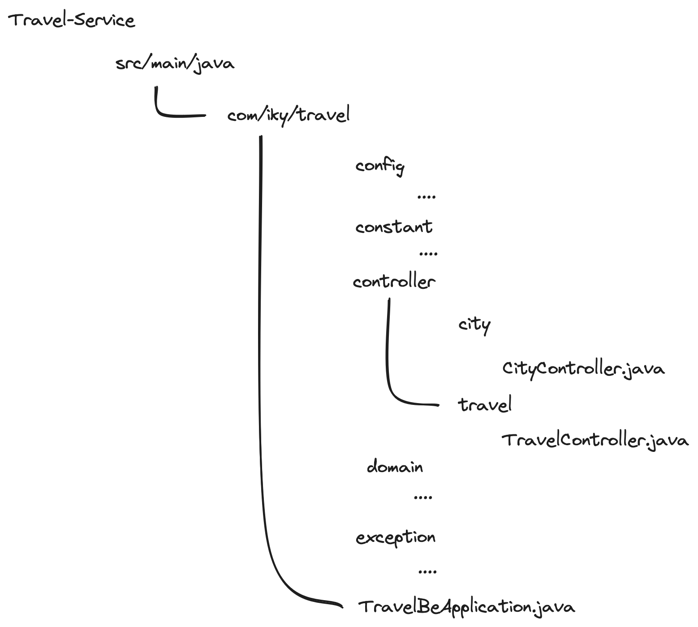
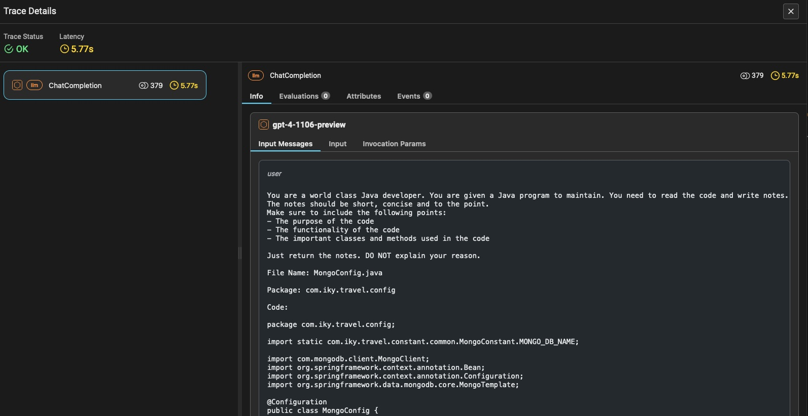
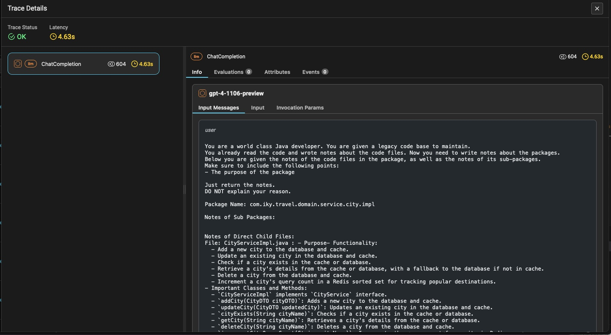
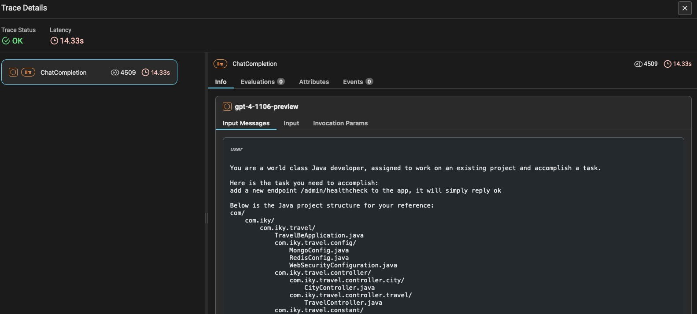

# Groom4J: LLM-Powered Task Planning for Java Projects


## 🎯 Bridging the Gap in Enterprise Java Development

Groom4J is designed to address a critical challenge in enterprise Java development: helping new or entry-level developers navigate and understand complex, established codebases. Unlike general-purpose coding assistants, Groom4J is tailored specifically for Java projects in enterprise environments, where the primary hurdles are often not in writing code, but in:

- **Understanding the big picture**: Grasping how different components of a large Java application interact.
- **Connecting the dots**: Identifying relationships between various packages, classes, and services.
- **Focus On Development Process**: Tailored for the unique challenges of large-scale, complex Java projects common in enterprise development process where coding is just one step in the middle.
- **Navigating internal complexity**: Making sense of company-specific architectures, patterns, and legacy code.

## Techniques:

- **Gisting Files and Packages**: This provides a hierarchical understanding of the project structure.
- **Cached Prompt**: Use cached prompt to reduce the cost and improve the response time, with Anthropic models.
- **Decomposing Questions**: Break down the question or task into smaller questions
- **Review Conversation**: After providing an answer, the LLM is asked to review the conversation and decide if it is time to stop.
- **Tier LLM Models**: Use different tier models for different purposes. For example, use a more powerful model for answering question, and a cheaper model for reviewing conversation.


## Inspiration

More about this project can be found at [what inspired this project](docs/inspiration.md)


## Getting Started

This project uses Python 3.11+ and Poetry to manage dependencies. You can run it directly on your system or use Docker for easier setup, especially if you're not familiar with Python environments.


## Set LLM and API Key

You can choose to use OpenAI, Gemini or Anthropic LLMs

```sh
cp application_example.yml application.yml
```

Depends on the LLM provider, you need to set the corresponding API key in the application.yml file.

```yaml
llm:
  use: anthropic
  max_tokens:
    tier1: 8192
    tier2: 4096
  
anthropic:
  api_key: ...
  model: 
    tier1: 
      name: claude-3-7-sonnet-20250219
    tier2: 
      name: claude-3-5-sonnet-latest
```


### Running with Poetry (for Python developers)

If you have Python and Poetry installed:

1. Install dependencies:

   ```sh
   poetry install
   ```
2. Run Tool

```sh
poetry run python gist_files.py path/to/the/Java/Project/Repo
poetry run python gist_packages.py path/to/the/Java/Project/Repo
poetry run python tell_me_about.py path/to/the/Java/Project/Repo --question="Your question"
```

### Running with Docker (recommended for Java developers)

If you prefer using Docker or are not familiar with Python environments:

Install Docker on your system if you haven't already.

Use the provided run-read-agent.sh script to run the tool:

```sh
# To gist files
./run-read-agent.sh gist-files /path/to/your/java/project

# To gist packages
./run-read-agent.sh gist-packages /path/to/your/java/project

# To groom a task
./run-read-agent.sh tell-me-about /path/to/your/java/project --question="Your question"
```

The script will automatically build the Docker image if needed and run the tool inside a container using Poetry. The Java project directory is mounted into the container, allowing the tool to access and analyze the project files.

Note: Make sure you have read access to the Java project directory you're trying to analyze.

## About Tracing (Optional)

This project supports opensource tracing tool langfuse (https://github.com/langfuse/langfuse)

```sh
git clone https://github.com/langfuse/langfuse
docker compose up -d
```

Visit <http://localhost:3000> to sign up, create a project, and create the API key. Then update the applicaiton.yml file with the API key.

```yaml
langfuse:
  secret_key: ...
  public_key: ...
  host: http://localhost:3000
```

## Example Java Project

For testing purpose, there is a sample Java project "travel-service-dev" included in the "data" folder. It is an open source project available at Github [https://github.com/ilkeratik/travel-service](https://github.com/ilkeratik/travel-service).



## Try the Example Java Project

The "gist" files are already created in the "data/travel-service-dev" project, under ".gist" folder. You can test the grooming with below command:

```sh
poetry run python tell_me_about.py ./data/travel-service-dev/ --question="how data flow from database to the API"
```

### Conversation Mode

For a more interactive experience, create a markdown file with your questions and use the `--conversation-file` flag:

```sh
poetry run python tell_me_about.py ./data/travel-service-dev/ --conversation-file conversations.md --thoroughness 8 --max-rounds 12
```

Example `conversations.md` format:
```markdown
# Conversation about Travel Service

## Question 1
How does the authentication system work?

## Question 2
What design patterns are used in the project?
```

The tool will process each question and append the answers to the markdown file.

### Advanced Options

- `--thoroughness`: Set the level of detail (1-10, default: 6)
- `--max-rounds`: Maximum conversation rounds before concluding (default: 8)
- `--breakdown`: Break complex questions into smaller parts for more detailed analysis

```bash
poetry run python tell_me_about.py ./data/travel-service-dev/ --question="Explain the entire architecture" --thoroughness 9 --max-rounds 12 --breakdown
```

For example, the generated answer to the question "how data flow from database to the API" can be found [data/travel-service-dev/.gist/tell_me_about/how_data_flow_from_database_to_the_api.md](./data/travel-service-dev/.gist/tell_me_about/how_data_flow_from_database_to_the_api.md)


## Use on Your Project

### **Step One to Gist code files**

```sh
poetry run python gist_files.py path/to/the/Java/Project/Repo
```

It will take a while before all the Java files are gisted. You will see a txt file "code_files.txt" generated afterwards, under the ".gist" folder within the Java project.

### **Step Two to Gist packages**

```sh
poetry run python gist_packages.py path/to/the/Java/Project/Repo
```

After the process is done, you will see a file "package_notes.txt" created in the ".gist" folder.

## Q&A

If you have a specific question to ask about the codebase, you can use below command to inspect the codebase

```sh
poetry run python tell_me_about.py path/to/the/Java/Project/Repo --question="..."
```

More info can be found in [tell_me_about](docs/tell_me_about.md)


## Groom A JIRA issue

In reality, developers often work on development stories from Jira. In this case, you can set up the necessary credentials and we can read the Jira story directly.

Make sure to set the JIRA properties in the .env file first.

```yaml
jira:
  server: https://[host].atlassian.net
  username: email@domain.com
  api_token: ...
```

```sh
poetry run python grooming_task.py path/to/the/Java/Project/Repo --jira=[issue key]
```

## Examples








---

# Embedding Providers for Memory

The memory system now supports multiple embedding providers to generate vector representations of text:

1. **OpenAI** - Uses OpenAI's text-embedding-3-small model (default)
2. **Google Gemini** - Uses Google's Gemini embedding models
3. **Sentence Transformers** - Fallback option that runs locally

## Configuration

You can configure the embedding provider in the `application.yml` file:

```yaml
vector_store:
  use: qdrant
  embedding_provider: auto  # Options: auto, openai, gemini
  qdrant:
    # Qdrant configuration...
```

Options for `embedding_provider`:
- `auto`: Try OpenAI first, then Gemini, then fall back to Sentence Transformers
- `openai`: Use only OpenAI embeddings
- `gemini`: Use only Google Gemini embeddings

## Requirements

### For OpenAI embeddings:
```
pip install openai tiktoken
```

### For Google Gemini embeddings:
```
pip install google-cloud-aiplatform
```

You'll also need to set up Google Cloud authentication:
```bash
# Set environment variable to your credentials file
export GOOGLE_APPLICATION_CREDENTIALS="/path/to/your-service-account-key.json"

# Alternatively, use gcloud CLI to authenticate
gcloud auth application-default login
```

### For Sentence Transformers (fallback):
```
pip install sentence-transformers
```

## Command-line Usage

You can specify the embedding provider when using the CLI:

```bash
python memory_cli.py --project-root /path/to/project --embedding-provider gemini search "authentication system"
```

## Embedding Dimensions

Different embedding providers produce vectors of different dimensions:
- OpenAI: 1536 dimensions
- Gemini: 768 dimensions
- Sentence Transformers: 384 dimensions (may vary based on model)

The system handles these differences automatically, but be aware that mixing embedding providers within the same collection is not recommended.

---